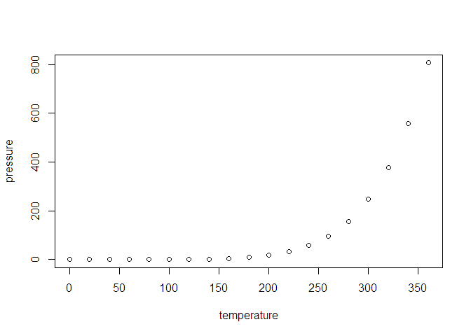

<!-- README.md is generated from README.Rmd. Please edit that file -->

# reproducible-paper-repo

<!-- badges: start -->
<!-- badges: end -->

## About this repo

This is a template repository with a folder structure that works well
for reproducible papers.

This readme file when knitted will become the landing page of the GitHub
repository.

It can contain chunks of code because the source document is Rmd.

For example:

``` r
summary(cars)
#>      speed           dist       
#>  Min.   : 4.0   Min.   :  2.00  
#>  1st Qu.:12.0   1st Qu.: 26.00  
#>  Median :15.0   Median : 36.00  
#>  Mean   :15.4   Mean   : 42.98  
#>  3rd Qu.:19.0   3rd Qu.: 56.00  
#>  Max.   :25.0   Max.   :120.00
```

You’ll still need to render `README.Rmd` regularly, to keep `README.md`
up-to-date.

You can also embed plots, for example:

<!-- -->

In that case, don’t forget to commit and push the resulting figure
files, so they display on GitHub.

The folder structure and the contents of the folders are suggestions
and/or examples. Keep or delete as you wish.
